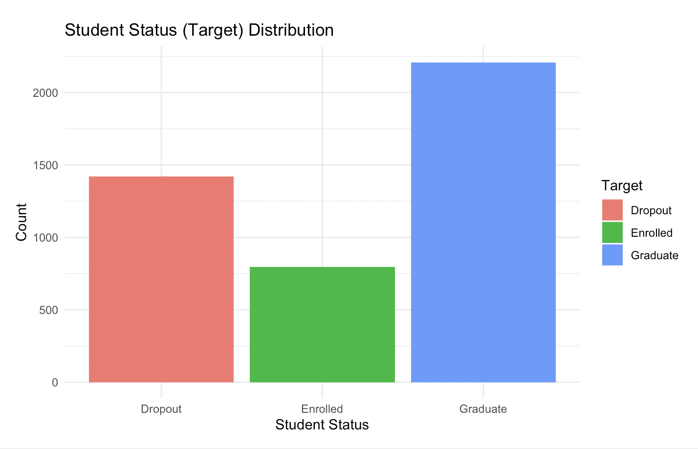
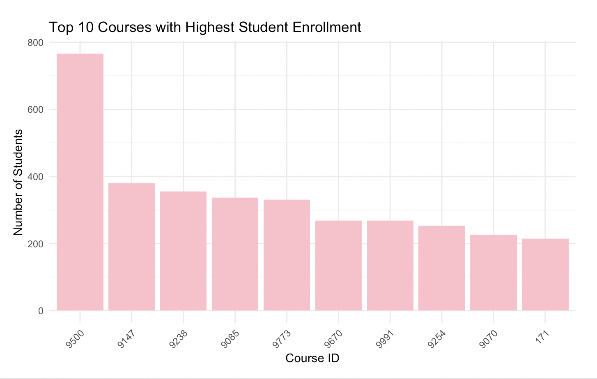

# 📌 GradX - Student Dropout Prediction

## 📝 Introduction
Student dropout is a major challenge in higher education. This project aims to predict whether a student will **graduate or drop out** based on various academic, financial, and demographic factors. Using **logistic regression**, we analyze key predictors of student success and provide insights for improving student retention.

## 📂 Files Included
- **`GradX.Rmd`** - R Markdown file containing the full analysis and modeling.
- **`data.csv`** - Dataset containing student enrollment records.
- **`README.md`** - Project documentation.

## 📚 Libraries Used
The following R packages were used in this project:
- `tidyverse` - Data manipulation and visualization
- `ggplot2` - Data visualization
- `dplyr` - Data transformation
- `readr` - CSV file reading
- `car` - Variance Inflation Factor (VIF) analysis
- `caret` - Model training and evaluation

## 🚀 Key Features
- **Data Cleaning & Preprocessing** - Handles missing values and prepares the dataset.
- **Exploratory Data Analysis (EDA)** - Visualizations of student enrollment trends and dropout rates.
- **Logistic Regression Model** - Predicts whether a student will **graduate or drop out**.
- **Variance Inflation Factor (VIF) Analysis** - Checks for multicollinearity among predictors.
- **Train-Test Evaluation** - Measures accuracy, sensitivity, and specificity.
- **Dropout Prediction for New Students** - Uses the trained model to classify new student records.

## 📊 Results and Insights

### **1️⃣ Dropout vs Graduation Rate**
Below is a bar chart showing the distribution of students who **graduated vs. dropped out**.



🔹 **Insight**: The dataset contains a significant number of dropouts compared to graduates. Identifying factors influencing dropout can help implement targeted interventions.

### **2️⃣ Course Enrollment Trends**
The following chart displays the **top 10 courses** with the highest student enrollment.



🔹 **Insight**: Some courses have significantly higher student enrollment, which may indicate program popularity or high demand.

### **Model Performance**
- **Accuracy:** ~80.8%
- **Sensitivity (Recall for Graduates):** 62.3%
- **Specificity (Recall for Dropouts):** 92.7%

### **Actionable Insights**
1. **Scholarship Programs Significantly Reduce Dropout Rates**
   - Students receiving scholarships have a **higher probability of graduating**.
   - **Action:** Increase scholarships or introduce financial aid programs to support at-risk students.

2. **Early Academic Performance is a Key Indicator of Retention**
   - **First-semester grades and course load** strongly correlate with dropout likelihood.
   - **Action:** Implement early **mentoring, tutoring, and academic support** programs.

## 📥 How to Use This Project
1. **Clone the repository**
   ```sh
   git clone https://github.com/your-username/GradX-Student-Dropout-Prediction.git
   ```
2. **Open the `GradX.Rmd` file in RStudio**.
3. **Run all code chunks** to train the model and analyze results.

---
🚀 **Future Work:** Additional predictors such as **tuition fees and socioeconomic background** could be incorporated for improved accuracy.
